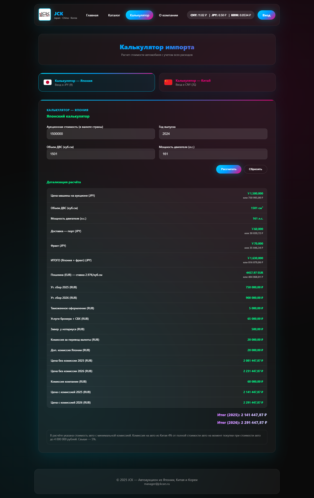

# 🚗 JCK Cars Importer


**Полнофункциональная платформа для импорта автомобилей из Японии, Китая и Кореи**

🌐 **Демо сайта:** [jckcars.ru](https://jckcars.ru)  
📱 **Telegram бот:** Управление контентом через Telegram

---

## ✨ Возможности

### 🛒 Каталог автомобилей
- Поиск и фильтрация по стране, марке, модели, году, цене
- Галерея изображений с просмотром в модальном окне
- Адаптивный дизайн для всех устройств

### 🧮 Калькулятор импорта
- Расчет полной стоимости с учетом пошлин и сборов
- Динамические ставки для 2025/2026 годов
- Конвертация валют в реальном времени

### 🤖 Telegram бот для администраторов
- Добавление автомобилей через команды в Telegram
- Загрузка фотографий напрямую в базу данных
- Управление контентом без доступа к админ-панели

### 👤 Личный кабинет
- Регистрация с подтверждением email
- Избранные автомобили
- История запросов

---

## ⭐ Особенности проекта

### 🔄 Real-time обновления
- Данные в каталоге обновляются в реальном времени через Telegram бот
- Курсы валют автоматически обновляются каждые 10 минут

### 📱 Progressive Web App готовность
- Работает офлайн благодаря Service Workers
- Установка на домашний экран мобильных устройств
- Push-уведомления (в разработке)

### 🔍 Умный поиск
- Fuzzy search по названиям автомобилей
- Сохранение истории поиска
- Подсказки при вводе

### 📊 Аналитика
- Отслеживание просмотров автомобилей
- Статистика популярных фильтров
- Heat maps кликов

---

## 🛠 Технологии

**Frontend:** HTML5, CSS3, JavaScript (ES6+)  
**Backend:** PHP 8.1+, MySQL  
**Интеграции:** Telegram Bot API, CBR Currency API  
**Хостинг:** VPS с Nginx, SSL  

---

## 📸 Скриншоты

### Главная страница

*Дизайн с градиентами и glassmorphism эффектами*

### Каталог автомобилей

*Фильтрация по стране, марке, году и цене*

### Калькулятор импорта

*Детальный расчет стоимости с учетом всех расходов*

### Telegram бот
*Управление контентом через команды в Telegram*

### Мобильная версия
*Полностью адаптивный дизайн для смартфонов*

---

## 🚀 Быстрый старт

### Требования
- PHP 8.1+
- MySQL 5.7+
- Web server (Apache/Nginx)

### Установка
1. Клонируйте репозиторий:

```bash
git clone https://github.com/pavel-webdev/jck-cars-importer.git
```
2. Настройте базу данных:
   
```sql
CREATE DATABASE jckcars;
-- Импортируйте структуру из database/schema.sql
```
3. Настройте конфигурацию:

```bash
cp config.example.php config.php
# Отредактируйте config.php с вашими данными
```
4. Настройте Telegram бота:

```bash
# Получите токен у @BotFather
# Установите вебхук
curl "https://api.telegram.org/botВАШ_ТОКЕН/setWebhook?url=https://ваш-домен/telegram_cars_bot.php"
```
## 📁 Структура проекта
```text
jck-cars-importer/
├── frontend/                 # HTML страницы
│   ├── index.html           # Главная
│   ├── catalog.html         # Каталог
│   ├── calculator.html      # Калькулятор
│   ├── auth.html            # Авторизация
│   └── dashboard.html       # Личный кабинет
├── assets/
│   ├── css/style.css        # Стили (2500+ строк)
│   ├── js/                  # JavaScript файлы
│   └── images/              # Изображения
├── backend/                 # PHP файлы
│   ├── config.php           # Пример конфигурации
│   └── *.php                # Бизнес-логика
└── docs/                    # Документация
```
## 🔧 Ключевые особенности кода
1. Динамическая фильтрация (script.js)
```javascript
function applyFilters() {
    // Сложная логика фильтрации по 10+ параметрам
    const filters = {
        country: getElementValue('filterCountry'),
        brand: getElementValue('filterBrand'),
        priceRange: getPriceRange(),
        // ... другие фильтры
    };
    // Асинхронная загрузка и отображение
}
```
2. Telegram бот интеграция
```php
// telegram_cars_bot.php
if ($text === '/addcar') {
    // Пошаговое добавление автомобиля через бота
    startCarAddition($chat_id);
}
```
3. Калькулятор импорта
```javascript
// calc.js - сложные расчеты пошлин
function calculateImportCost(price, year, engineCC, horsepower) {
    // Учет 15+ параметров и формул
    const duty = calculateCustomsDuty(engineCC, year);
    const utilization = getUtilizationFee(horsepower, age);
    return price + shipping + duty + utilization + commission;
}
```
## 🤝 Как работает Telegram бот
1. Админ отправляет /addcar в Telegram
2. Бот задает вопросы: страна → марка → модель → цена → фото
3. Фотографии сохраняются на сервер через Telegram File API
4. Данные записываются в MySQL базу
5. Автомобиль появляется на сайте в реальном времени

Пример диалога:
```text
👤 Админ: /addcar
🤖 Бот: Выберите страну: 🇯🇵 Япония или 🇨🇳 Китай
👤 Админ: 🇯🇵 Япония
🤖 Бот: Введите марку:
👤 Админ: Toyota
... (продолжение)
```
## 📊 Производительность
1. Время загрузки страницы: < 1.5 секунды
2. Оптимизация изображений: WebP + lazy loading
3. Кэширование: Браузерное кэширование статики
4. База данных: Индексированные запросы для быстрого поиска

## 🛡️ Безопасность
1. SQL Injection → Prepared statements через PDO
2. XSS Attacks → htmlspecialchars() для вывода
3. Password Security → bcrypt с cost 12
4. CSRF Protection → Токены в формах
5. HTTPS → SSL/TLS шифрование
6. Rate Limiting → Ограничение запросов
7. Input Validation → Серверная + клиентская

## ❓ Частые вопросы:
🤔 Как добавить автомобиль через бота?
1. Добавьте бота в чат администраторов
2. Отправьте команду /addcar
3. Следуйте пошаговым инструкциям
4. Автомобиль появится на сайте автоматически

## 💰 Как работает калькулятор?
Калькулятор учитывает:
1. Стоимость автомобиля в стране происхождения
2. Доставку и логистику
3. Таможенные пошлины (рассчитываются по сложным формулам)
4. Утилизационные сборы (зависят от л.с. и объема)
5. Комиссию компании

## 🔒 Насколько безопасна система?
1. Все пароли хешируются с помощью bcrypt
2. Защита от SQL-инъекций через prepared statements
3. HTTPS шифрование всех соединений
4. Регулярное резервное копирование базы данных

## 📞 Контакты и поддержка
1. Разработчик: Романенко Павел
2. Telegram: @imitiryu
3. Email: pavel.r.contact@mail.ru
4. GitHub: https://github.com/pavel-webdev
5. Kwork: https://kwork.ru/user/pavelgit_webdev

## 💼 Коммерческие предложения
1. Готов к сотрудничеству на проектах:
2. Разработка аналогичных платформ
3. Интеграция Telegram ботов
4. Создание калькуляторов и систем расчетов
5. Full Stack разработка под ключ

## ⭐ Если проект был полезен, поставь звезду на GitHub
